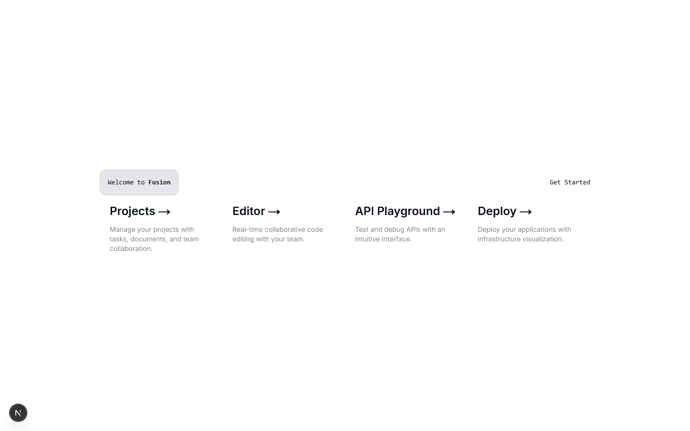
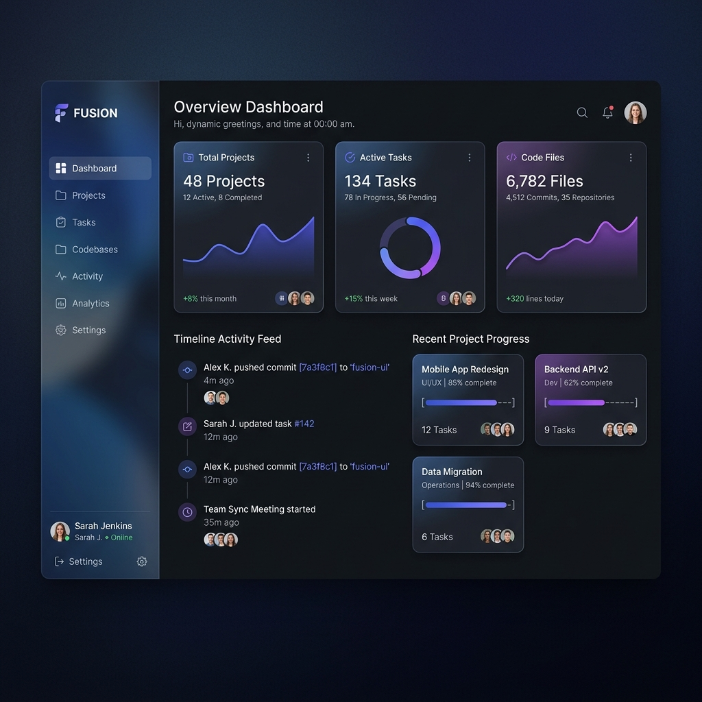
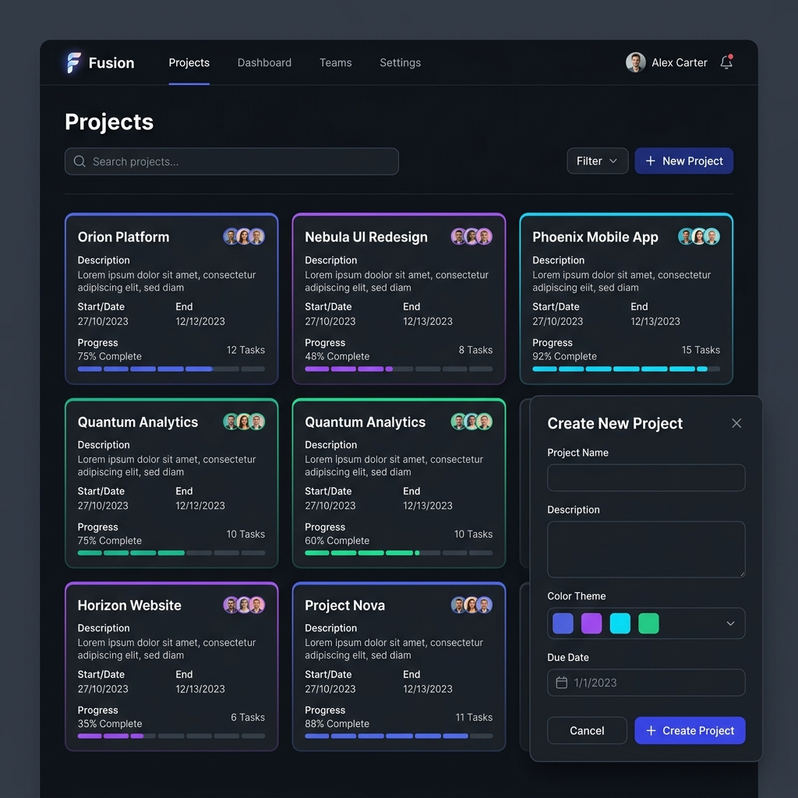
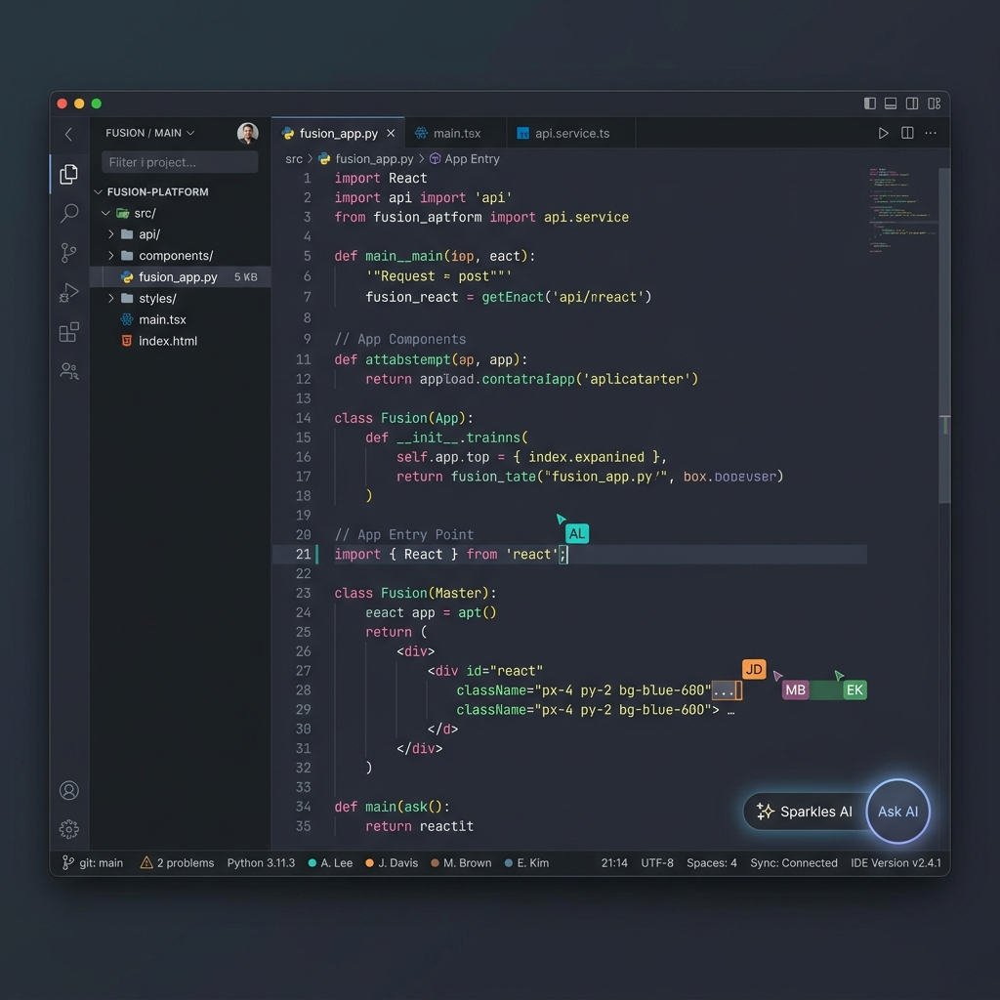
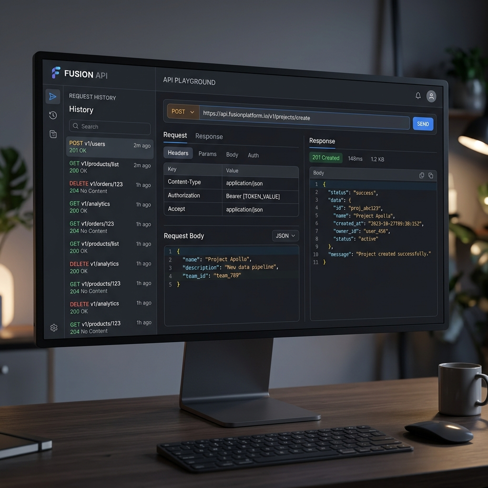
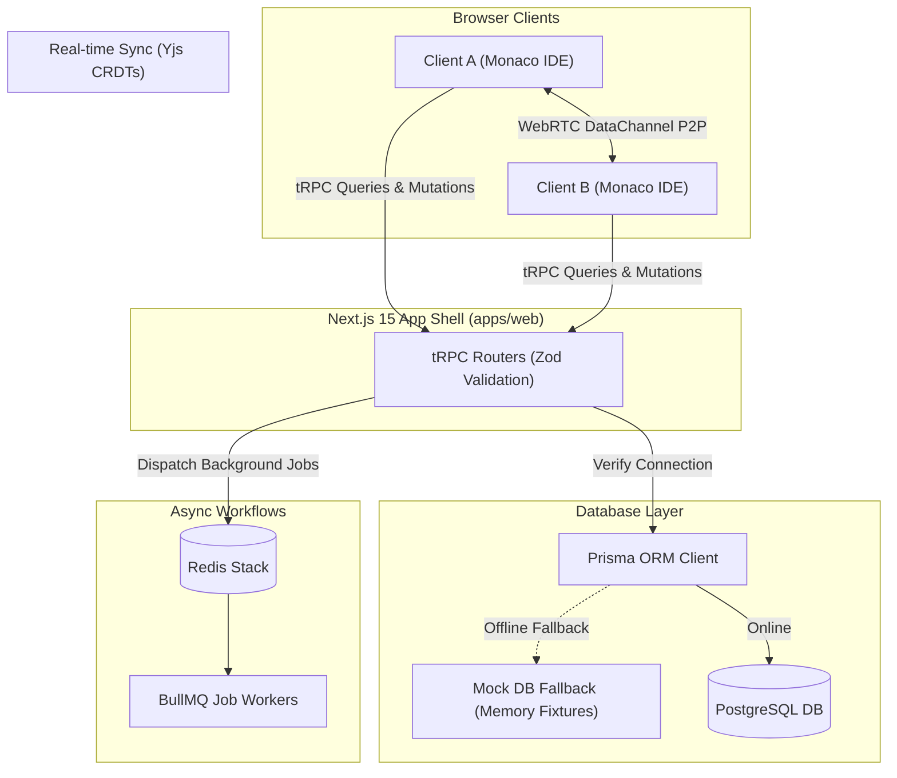

# Fusion 🚀

> **Real-time collaborative developer platform for modern product teams.**  
> Built as a type-safe TypeScript monorepo with Next.js 15, Turbopack, tRPC v11, Prisma, Yjs CRDTs, BullMQ, and Clerk auth.

---

## 🎨 Gallery & Viewports

### 1. Welcome Landing Page
An animated, dark-mode landing page designed to greet developers and showcase product features.


### 2. Workspace Dashboard
A glassmorphic command center showing time-based greetings, real-time stat widgets, project progression meters, and user activity timelines.


### 3. Projects & Kanban Task Board
A repository browser supporting grid and list toggles, accent tags, task progress meters, and drag-to-shift Kanban task pipelines.


### 4. Collaborative Code IDE
A real-time, multi-cursor, peer-connected Monaco editor workspace featuring collapsible file trees and metadata status bars.


### 5. API Client Playground
A Postman-like client console to trigger REST queries, save request headers, and view timing details and JSON response payloads.


---

## ⚡ Architecture Flow

Here is how data and synchronization move through the Fusion monorepo layers:



## 💎 What Makes Fusion Unique?

Unlike standard Next.js boilerplates or collaborative mock editors, Fusion introduces several innovative design decisions:

### 1. Zero-Dependency Developer Portability (Automatic Mock Fallback)
* **The Problem**: Almost all Next.js projects fail to run out-of-the-box because they crash immediately if database credentials or Redis connection handles are missing.
* **Fusion's Solution**: When tRPC routers initialize, they ping the Prisma Client. If PostgreSQL is offline, Fusion switches to a reactive, in-memory **Mock Database**. You can edit code, save tasks, write API logs, and navigate the app without setting up local databases.

### 2. Serverless Peer-to-Peer Collaborative Sync (Zero Latency & Cost)
* **The Problem**: Real-time collaborative editors usually require heavy WebSockets syncing instances (like a separate Node server running Yjs-WebSocket adapters) or expensive SaaS plans.
* **Fusion's Solution**: Fusion implements local WebRTC signaling via `y-webrtc`. Client editor modifications travel directly peer-to-peer over local WebRTC DataChannels. Latency is near-zero (limited only by peer ping), and there is **zero server hosting overhead** for syncing editor document states.

### 3. Integrated API Playground & Project Association
* **The Problem**: Developers have to hop back and forth between their codebases, web dashboards, and tools like Postman or Insomnia.
* **Fusion's Solution**: Fusion links your testing environments directly to your projects. The built-in client playground logs and stores custom headers, query params, and timing parameters inside the workspace itself, forming a shareable, type-safe API playbook for the entire team.

---

## ⚙️ How It Works

### 1. Real-time Collaboration (P2P CRDTs)
Real-time syncing in the editor utilizes **Yjs** (Conflict-free Replicated Data Types) bound to **Monaco Editor** (`y-monaco`). Communication is established directly between browser peers using **y-webrtc** over WebRTC signaling.
* *No server synchronization overhead in development mode.*

### 2. End-to-End Type Safety
Communication between the frontend Next.js pages and the database layers is governed by **tRPC v11**.
* Type definitions are shared directly at compile time.
* Request bodies and input parameters are validated automatically using **Zod** schema guards.
* Responses are serialized natively with **superjson** to preserve data types (such as `Date` objects).

### 3. Zero-Config Database Fallback
For ease of setup, the application implements an automatic **Mock DB Fallback**. If the Prisma Client detects that Postgres is unreachable, the tRPC routers seamlessly fall back to local in-memory fixtures.
* Set `FUSION_USE_MOCK_DB=0` in `.env.local` to disable this behavior and force real database queries.

### 4. Background Job Pipelines
Heavy workloads (like code reviews, mock evaluations, or bulk notifications) are offloaded to **BullMQ** workers connected to a local **Redis** instance.

---

## 🚀 Quick Start

Ensure you have [Node.js v20+](https://nodejs.org) and [pnpm](https://pnpm.io) installed.

### 1. Setup the project
```bash
# Clone the repository and install dependencies
pnpm install

# Copy environment variables
cp .env.example .env.local

# Generate Prisma Client models
pnpm db:generate
```

### 2. Boot the Development Environment
```bash
pnpm dev
```
Open **[http://localhost:3000](http://localhost:3000)** (or **http://localhost:3001** if port 3000 is occupied). 

*Note: In development, you do not need Postgres or Redis running unless you disable the Mock DB or trigger BullMQ queues. The app runs fully offline out-of-the-box.*

---

## 📖 How to Use

### Real-Time Coding
1. Navigate to the **Code Editor** tab.
2. Select a file in the explorer tree (e.g. `index.ts`).
3. Copy the URL and open it in a second window (or share it with a teammate).
4. Watch cursor markers and code synchronization update instantly as you type.

### Task Management
1. Go to **Projects**, create a project, and pick an accent theme.
2. Open the project and navigate to the **Tasks** tab.
3. Click **Add Task**, input details, and set the priority to **Urgent** to view the warning glow effect.
4. Shift tasks between lanes (To Do, In Progress, Review, Done) using the arrow action overlays.

### Testing REST Endpoints
1. Open the **API Playground**.
2. Input a URL (such as `https://jsonplaceholder.typicode.com/posts/1`).
3. Add request headers or query parameters in the key-value tables.
4. Click **Send** to dispatch the request and inspect the JSON output, payload size, and response times.

---

## 📁 Repository Structure

```
fusion/
├── apps/web             → Next.js 15 web application (App router pages + tRPC adapter handlers)
├── packages/
│   ├── ai               → OpenAI prompt templates and helper libraries
│   ├── auth             → Clerk auth middleware configuration
│   ├── db               → Prisma database schema models and clients
│   ├── queue            → BullMQ scheduler jobs and worker listeners
│   ├── types            → Shared validation Zod schemas and types
│   └── ui               → Reusable Tailwind component primitives
├── docs/                → Detailed docs (architecture, database design, API routing endpoints)
└── turbo.json           → Monorepo Turbopack configuration settings
```

---

## 🛠️ CLI Reference

Run these scripts from the repository root:

| Command | Action |
|---|---|
| `pnpm dev` | Starts Next.js with Turbopack dev server |
| `pnpm build` | Compiles production bundle optimization |
| `pnpm type-check` | Runs TypeScript compilation diagnostic tests |
| `pnpm lint` | Validates style and formatting rules |
| `pnpm db:generate` | Builds Prisma ORM client typescript typings |
| `pnpm db:studio` | Opens Prisma GUI database explorer |
| `pnpm format` | Auto-formats code files using Prettier |

---

## 📄 License
Licensed under the [MIT License](LICENSE).
